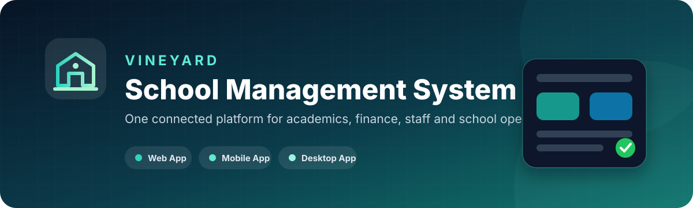
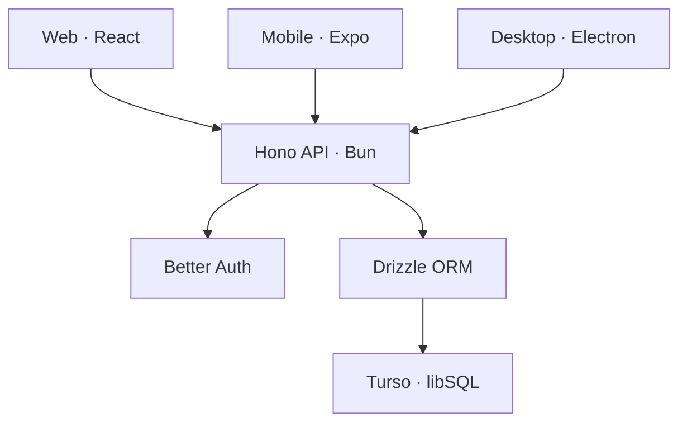

<p align="center">
  
</p>

<p align="center">
  <a href="https://vineyard-sms-gq1q.onrender.com"></a>
  
  
  
</p>

## Overview

**Vineyard School Management System** is a role-based platform that brings academic, financial, administrative, and communication workflows into one connected system.

The project includes dedicated **web, mobile, and desktop clients** backed by a shared API and database. It is designed for real school operations rather than a single-purpose classroom demo.

> **Production:** [vineyard-sms-gq1q.onrender.com](https://vineyard-sms-gq1q.onrender.com)

## What the platform manages

| Area | Capabilities |
| --- | --- |
| **Academics** | Students, classes, subjects, teacher assignment, attendance, exams, results, report cards, certificates, and timetables |
| **Finance** | Fees, payments, payroll, accounts, financial reporting, and accountant workflows |
| **Operations** | Staff, transport, library, inventory, school settings, and profile management |
| **Communication** | School-wide communication and role-specific information access |
| **Security** | Authentication, server-side authorization, role permissions, protected routes, and admin security tools |

## Supported roles

| Role | Primary access |
| --- | --- |
| **Admin** | Full system configuration, users, security, academics, operations, and finance |
| **Principal** | School oversight, staff, academics, fees, and management reports |
| **Teacher** | Assigned classes, students, attendance, exams, results, and academic workflows |
| **Accountant** | Fees, payments, payroll, accounts, and finance reports |

Permissions are enforced by the API. The interface also hides or redirects users from areas outside their assigned role.

## Architecture



## Technology stack

| Layer | Technology |
| --- | --- |
| **Web application** | React 19, Vite, Wouter, TanStack Query |
| **API** | Hono running on Bun |
| **Authentication** | Better Auth |
| **Database** | Turso/libSQL with Drizzle ORM |
| **Mobile application** | Expo and React Native |
| **Desktop application** | Electron |
| **Deployment** | Render |
| **Automation** | GitHub Actions |

## Repository structure

```text
.github/workflows/        Continuous integration
docs/                     Readiness and presentation documentation
packages/
  web/                    React web app and Hono API
  mobile/                 Expo mobile client
  desktop/                Electron desktop client
assets/                   Repository presentation assets
Dockerfile                Production container build
nixpacks.toml              Render/Nixpacks configuration
package.json               Bun workspace configuration
turbo.json                 Turborepo task configuration
```

## Run locally

### Requirements

- [Bun 1.3.5](https://bun.sh/)
- A Turso/libSQL database
- Git

### 1. Clone and install

```bash
git clone https://github.com/nuru999/VINEYARD-SMS.git
cd VINEYARD-SMS
bun install
```

### 2. Configure the environment

Create a root `.env` file. Never commit this file.

```env
DATABASE_URL=libsql://your-database.turso.io
DATABASE_AUTH_TOKEN=your-token
BETTER_AUTH_SECRET=replace-with-a-long-random-secret
WEBSITE_URL=http://localhost:4200
```

### 3. Start a client

```bash
# Web application — http://localhost:4200
bun run dev

# Mobile application
bun run dev:mobile

# Desktop application
bun run dev:desktop
```

The Electron client uses the production service by default. Set `REMOTE_URL` or `WEBSITE_URL` when targeting another environment.

## Database commands

```bash
bun run db:generate
bun run db:migrate
bun run db:push
bun run db:studio
```

Choose the command appropriate to the schema change. Back up production data before any destructive operation.

## Quality and security

- CI checks the frozen Bun lockfile, regression tests, web type checking, production builds, and mobile TypeScript.
- Secrets are stored in environment variables and excluded from source control.
- Password handling is delegated to Better Auth; plaintext passwords are never stored.
- Protected endpoints enforce role permissions server-side.
- Admin recovery and credential-rotation tools are intended for controlled operational use.
- The public health endpoint is limited to deployment and liveness checks.

Before merging an application change, keep both web and mobile workflows green.

## Presentation and deployment

- Review [`docs/PRESENTATION-READINESS.md`](./docs/PRESENTATION-READINESS.md) before a demonstration or release.
- Verify all four roles independently.
- Check the Render health endpoint and production environment variables.
- Confirm web, mobile, and desktop clients target the intended API.

## License

No open-source license is currently included. Unless a license is added, normal copyright restrictions apply.

---

<p align="center">
  Built and maintained by <a href="https://github.com/nuru999">Nuru Amudi</a>.
</p>